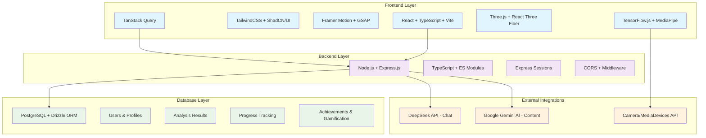
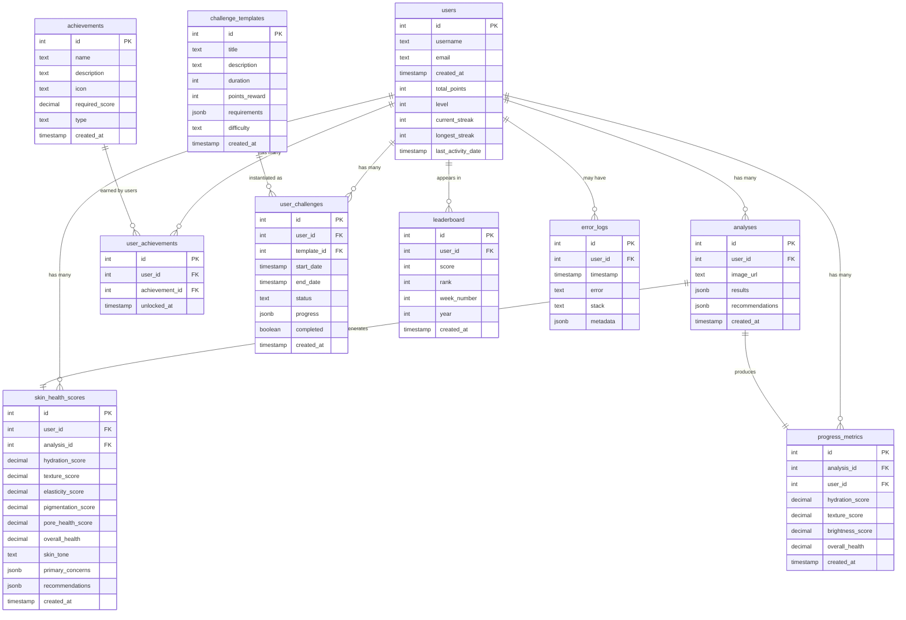
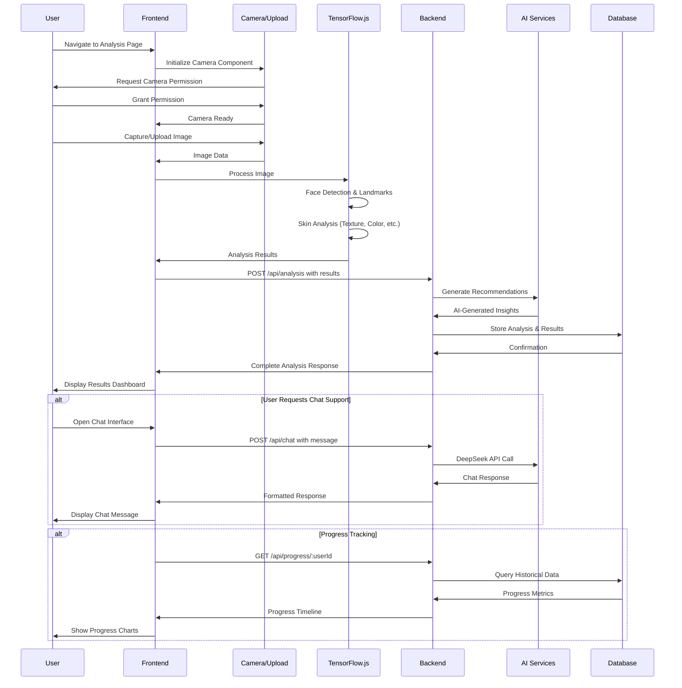

# ElectrofyneSkinAI - Architectural Document

## Table of Contents
1. [Application Overview](#application-overview)
2. [System Architecture](#system-architecture)
3. [Main Components](#main-components)
4. [Key Data Models](#key-data-models)
5. [Core Workflows](#core-workflows)
6. [Technology Stack](#technology-stack)
7. [External Integrations](#external-integrations)
8. [Deployment Architecture](#deployment-architecture)
9. [Security Considerations](#security-considerations)
10. [Performance Optimizations](#performance-optimizations)

---

## Application Overview

### Purpose
ElectrofyneSkinAI is a comprehensive AI-powered skincare analysis platform that provides real-time facial skin analysis using advanced computer vision and machine learning technologies. The application delivers personalized skincare recommendations, progress tracking, and educational content through an intuitive, mobile-first web interface.

### Key Features
- **AI Skin Analysis**: Real-time face scanning with detailed skin health metrics using TensorFlow.js and MediaPipe
- **Personalized Recommendations**: Product suggestions based on analysis results [[memory:3136505]]
- **Progress Tracking**: Timeline view of skin improvement over time with gamification elements
- **Educational Content**: Interactive learning modules about skincare science
- **AI Chat Assistant**: Intelligent skincare advisor powered by DeepSeek API
- **Gamification System**: Achievement system with streaks, leaderboards, and challenges
- **3D Visualization**: AR skin visualization using Three.js and React Three Fiber

### Target Users
- Individuals seeking personalized skincare solutions
- Beauty enthusiasts interested in skin health tracking
- Users looking for AI-powered skincare guidance and education

---

## System Architecture

### Architecture Patterns
- **Client-Server Architecture**: Clear separation between frontend and backend
- **RESTful API Design**: Standard HTTP methods for API communication
- **Single Page Application (SPA)**: React-based frontend with client-side routing
- **Session-Based Authentication**: Express sessions with memory store
- **Component-Based UI**: Modular React components with TypeScript
- **Real-time Processing**: Client-side ML processing for immediate feedback

---

## Main Components

### Frontend Components

#### Core Analysis Components
- **FaceAnalysisView**: Real-time face detection and analysis using TensorFlow.js
- **ImageUpload**: Camera integration with permission handling and file upload
- **AnalysisResults**: Comprehensive results display with interactive visualizations
- **ARSkinVisualization**: 3D skin visualization using Three.js
- **TextureAnalysisView**: Advanced texture analysis and visualization

#### User Interface Components
- **Navigation**: Top navigation and mobile bottom navigation
- **BottomNav**: Mobile-optimized bottom navigation bar
- **OnboardingTutorial**: Interactive feature introduction
- **CameraPermissionDialog**: Guided camera permission requests

#### Feature Components
- **SkinChatBot**: AI-powered skincare assistant interface
- **ProgressDashboard**: Historical progress tracking and visualization
- **DailySkinTracker**: Daily routine tracking and streaks
- **ProductRecommendations**: AI-generated product suggestions
- **EducationModules**: Interactive learning content
- **Achievements**: Gamification system with badges and rewards
- **Leaderboard**: Community engagement and competition
- **SocialShare**: Privacy-focused result sharing

### Backend Components

#### API Routes Structure
- **User Management**: Registration, authentication, profile management
- **Analysis Endpoints**: Image processing, result storage, history retrieval
- **Chat System**: AI-powered skincare consultation
- **Progress Tracking**: Metrics aggregation and timeline generation
- **Gamification**: Achievement tracking, leaderboard management
- **Challenge System**: Dynamic challenge creation and progress tracking

#### Core Services
- **Session Management**: Express sessions with memory store
- **Error Handling**: Comprehensive error logging and recovery
- **Rate Limiting**: API protection and abuse prevention
- **File Upload Handling**: Large image file processing (50MB limit)
- **Retry Mechanisms**: Robust external API integration

### Database Layer

#### PostgreSQL with Drizzle ORM
- **Type-Safe Queries**: Drizzle ORM with TypeScript integration
- **Schema Validation**: Zod-based validation for data integrity
- **Migration Management**: Version-controlled database schema changes
- **Connection Pooling**: Optimized database connection management

---

## Key Data Models

### Data Model Details

#### User Management
- **users**: Core user profiles with gamification metrics (points, levels, streaks)
- **user_achievements**: Junction table for user-earned achievements
- **user_challenges**: Active and completed user challenges with progress tracking

#### Analysis System
- **analyses**: Core analysis results with image URLs and JSON metadata
- **skin_health_scores**: Detailed skin metrics with Fitzpatrick scale classification
- **progress_metrics**: Historical tracking data for trend analysis

#### Gamification System
- **achievements**: Template definitions for unlockable achievements
- **challenge_templates**: Reusable challenge configurations
- **leaderboard**: Weekly competitive rankings

#### System Monitoring
- **error_logs**: Comprehensive error tracking with user context and stack traces

---

## Core Workflows

### Skin Analysis Workflow

### Key Workflow Processes

#### 1. Image Capture and Processing
1. **Camera Initialization**: Permission handling and device enumeration
2. **Image Capture**: Real-time video processing or file upload
3. **Face Detection**: TensorFlow.js face detection and landmark identification
4. **Skin Analysis**: Custom algorithms for texture, hydration, and pigmentation analysis
5. **Result Generation**: Comprehensive scoring and issue identification

#### 2. AI-Powered Recommendations
1. **Data Processing**: Analysis results sent to backend
2. **AI Integration**: Google Gemini AI for content generation [[memory:3136505]]
3. **Personalization**: Context-aware product and routine recommendations
4. **Storage**: Results persistence with user history tracking

#### 3. Progress Tracking and Gamification
1. **Metric Calculation**: Score comparison with historical data
2. **Achievement Evaluation**: Progress-based achievement unlocking
3. **Challenge Management**: Dynamic challenge creation and completion tracking
4. **Leaderboard Updates**: Weekly ranking recalculation

#### 4. Educational Content Delivery
1. **Adaptive Learning**: Content personalized to skin analysis results
2. **Interactive Modules**: Step-by-step skincare education
3. **Progress Tracking**: Learning completion and knowledge retention

---

## Technology Stack

### Frontend Technologies

#### Core Framework
- **React 18.3.1**: Modern React with hooks and concurrent features
- **TypeScript 5.7.3**: Type-safe development with strict typing
- **Vite 5.4.11**: Fast development server and optimized builds

#### Styling and UI
- **Tailwind CSS 3.4.17**: Utility-first CSS framework
- **ShadCN/UI**: Accessible component library built on Radix primitives
- **Radix UI**: Comprehensive primitive component collection
- **PostCSS**: CSS processing and optimization

#### State Management and Data
- **TanStack Query 5.64.1**: Server state management and caching
- **React Hook Form 7.53.1**: Performant form handling
- **Zod 3.23.8**: TypeScript-first schema validation

#### Animations and Interactions
- **Framer Motion 11.17.0**: Declarative animations and gestures
- **GSAP 3.12.5**: High-performance timeline animations
- **Lottie React 2.4.0**: Complex animated graphics

#### Machine Learning and 3D
- **TensorFlow.js 4.22.0**: Client-side machine learning
- **MediaPipe**: Face detection and mesh generation
- **Three.js 0.172.0**: 3D graphics and visualization
- **React Three Fiber 8.17.10**: React renderer for Three.js

#### Routing and Navigation
- **Wouter 3.3.5**: Lightweight client-side routing
- **Lucide React 0.453.0**: Beautiful SVG icon library

### Backend Technologies

#### Runtime and Framework
- **Node.js**: JavaScript runtime for server-side execution
- **Express.js 4.21.2**: Web application framework
- **TypeScript**: Type-safe server-side development
- **TSX 4.19.2**: TypeScript execution environment

#### Database and ORM
- **PostgreSQL**: Relational database with JSONB support
- **Drizzle ORM 0.38.3**: Type-safe database toolkit
- **Drizzle Kit 0.20.13**: Database migration and introspection tools
- **Postgres 3.4.5**: PostgreSQL client for Node.js

#### Session and Security
- **Express Session 1.18.1**: Session middleware for Express
- **MemoryStore 1.6.7**: Memory-based session storage
- **CORS 2.8.5**: Cross-origin resource sharing
- **Passport.js 0.7.0**: Authentication middleware

#### Build and Development
- **esbuild 0.24.0**: Fast JavaScript bundler
- **Autoprefixer 10.4.20**: CSS vendor prefixing
- **ESBuild**: Production build optimization

### Development Tools

#### Type Safety and Validation
- **TypeScript**: Static type checking across the entire stack
- **Zod**: Runtime type validation and schema generation
- **Drizzle Zod**: Database schema to Zod schema generation

#### Data Visualization
- **Recharts 2.13.0**: Composable charting library
- **React Icons 5.4.0**: Popular icon libraries as React components

#### Utilities
- **Date-fns 3.6.0**: Modern JavaScript date utility library
- **Class Variance Authority**: Type-safe CSS class composition
- **Tailwind Merge**: Intelligent Tailwind class merging

---

## External Integrations

### AI and Machine Learning Services

#### Chat and Content Generation
- **DeepSeek API**: Advanced conversational AI for skincare consultation
  - **Usage**: Intelligent chat responses and personalized advice
  - **Integration**: RESTful API with retry mechanisms and error handling
  - **Features**: Context-aware responses, skin concern analysis, product recommendations

- **Google Gemini AI**: Content generation and strategy planning [[memory:3136505]]
  - **Usage**: Marketing content, educational material generation
  - **Configuration**: GOOGLE_API_KEY environment variable
  - **Model**: Gemini 1.5 Pro for high-quality content generation

#### Computer Vision and Analysis
- **TensorFlow.js Models**: Client-side machine learning
  - **Face Detection Model**: Real-time face boundary detection
  - **Face Landmarks Detection**: 468-point facial landmark identification
  - **Custom Analysis**: Proprietary skin texture and condition analysis

- **MediaPipe**: Google's framework for multimodal perception
  - **Face Mesh**: High-fidelity facial geometry tracking
  - **Camera Utils**: Advanced camera handling and optimization

### Browser APIs

#### Media and Device Access
- **MediaDevices API**: Camera and microphone access
- **WebRTC**: Real-time video processing
- **File API**: Image upload and processing
- **Permissions API**: Graceful permission handling

#### Storage and Performance
- **Web Storage API**: Local data persistence
- **IndexedDB**: Client-side structured data storage
- **WebGL**: Hardware-accelerated graphics rendering

### Development and Deployment

#### Version Control and CI/CD
- **Git**: Source code version control
- **Replit**: Cloud-based development environment
- **Environment Variables**: Secure API key management

#### Monitoring and Analytics
- **Error Logging**: Custom error tracking system
- **Performance Monitoring**: Built-in performance tracking
- **User Analytics**: Privacy-focused usage analytics

---

## Deployment Architecture

### Development Environment
- **Vite Dev Server**: Hot module replacement and fast refresh
- **TypeScript Compiler**: Real-time type checking
- **Express Development Server**: API development with live reload
- **Memory Session Store**: Development session management

### Production Build Process
1. **Frontend Build**: Vite optimizes and bundles React application
2. **Backend Compilation**: ESBuild compiles TypeScript server code
3. **Asset Optimization**: Image compression and static asset optimization
4. **Bundle Analysis**: Performance optimization and tree shaking

### Production Infrastructure
- **Static Asset Serving**: Optimized static file delivery
- **Session Management**: Production-grade session storage
- **Database Connection Pooling**: Optimized PostgreSQL connections
- **Error Handling**: Comprehensive error logging and recovery
- **Environment Configuration**: Secure environment variable management

### Scalability Considerations
- **Horizontal Scaling**: Stateless server design for load balancing
- **Database Optimization**: Query optimization and indexing strategies
- **CDN Integration**: Static asset delivery optimization
- **Caching Strategy**: Application-level and database-level caching

---

## Security Considerations

### Data Protection
- **Input Validation**: Comprehensive validation using Zod schemas
- **SQL Injection Prevention**: Parameterized queries with Drizzle ORM
- **XSS Protection**: React's built-in XSS prevention
- **CSRF Protection**: Session-based CSRF token validation

### API Security
- **Rate Limiting**: API endpoint protection against abuse
- **Authentication**: Session-based user authentication
- **Authorization**: Role-based access control
- **Error Handling**: Secure error messages without information leakage

### Privacy and Compliance
- **Data Minimization**: Collecting only necessary user data
- **Image Processing**: Client-side processing for privacy
- **User Consent**: Clear consent mechanisms for data collection
- **Data Retention**: Configurable data retention policies

### Infrastructure Security
- **Environment Variables**: Secure API key management
- **HTTPS Enforcement**: Secure data transmission
- **Session Security**: Secure session configuration
- **Database Security**: Connection encryption and access controls

---

## Performance Optimizations

### Frontend Performance
- **Code Splitting**: Dynamic imports for reduced initial bundle size
- **Lazy Loading**: Component-level lazy loading
- **Image Optimization**: Responsive images and format optimization
- **Bundle Analysis**: Tree shaking and dead code elimination

### Machine Learning Optimization
- **Model Caching**: TensorFlow.js model caching for faster subsequent loads
- **WebGL Backend**: Hardware acceleration for ML computations
- **Progressive Loading**: Incremental model loading for better UX
- **Memory Management**: Efficient tensor disposal and garbage collection

### Database Performance
- **Query Optimization**: Efficient database queries with proper indexing
- **Connection Pooling**: Optimized database connection management
- **Data Pagination**: Efficient large dataset handling
- **Caching Strategy**: Query result caching for frequently accessed data

### Real-time Processing
- **Client-side Processing**: Immediate feedback without server round-trips
- **Streaming Analysis**: Progressive analysis result delivery
- **Background Processing**: Non-blocking analysis operations
- **WebWorker Integration**: CPU-intensive tasks in background threads

### Network Optimization
- **API Response Compression**: Gzip compression for API responses
- **Request Batching**: Efficient API call grouping
- **Retry Mechanisms**: Robust network error handling
- **Progressive Enhancement**: Graceful degradation for slower connections

---

## Future Scalability and Extensibility

### Planned Enhancements
- **Multi-language Support**: Internationalization and localization
- **Advanced AI Models**: Integration of newer vision models
- **Real-time Collaboration**: Social features and community engagement
- **Mobile App**: Native mobile application development

### Technical Debt Management
- **Continuous Refactoring**: Regular code quality improvements
- **Dependency Updates**: Regular security and performance updates
- **Performance Monitoring**: Continuous performance optimization
- **Code Coverage**: Comprehensive testing strategy implementation

### Integration Possibilities
- **Third-party Skincare Brands**: Product catalog integration
- **Healthcare Providers**: Dermatologist consultation integration
- **Wearable Devices**: Health tracking device integration
- **E-commerce Platforms**: Direct product purchasing integration

---

*This architectural document serves as a comprehensive guide to the ElectrofyneSkinAI platform's technical implementation, providing insights for development, maintenance, and future enhancements.*
